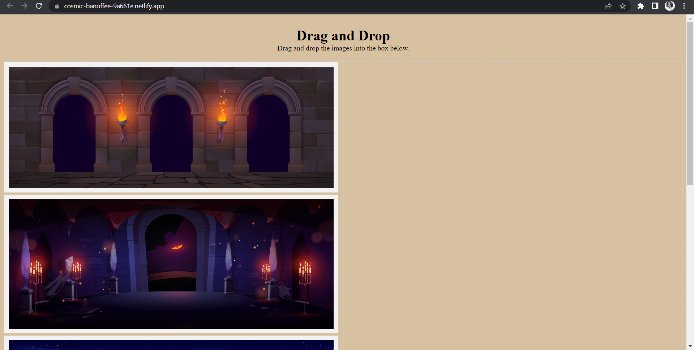
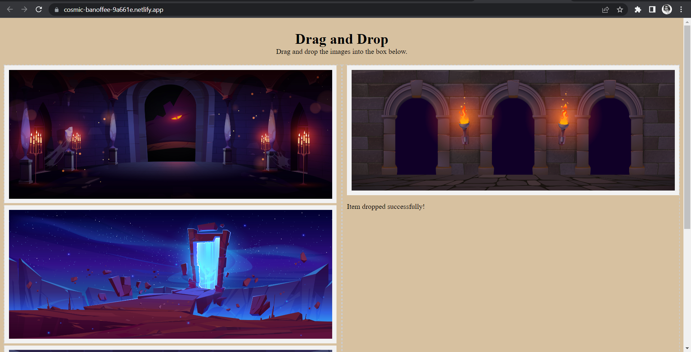
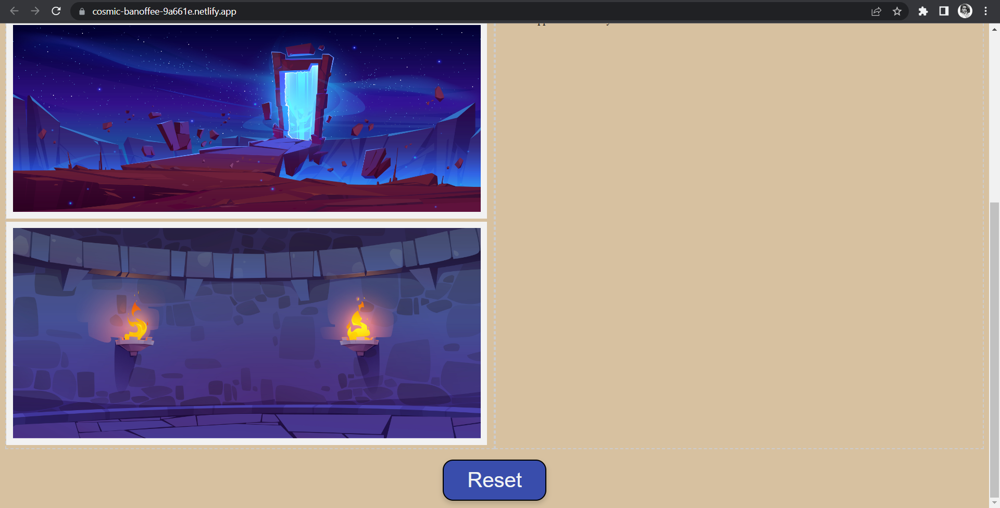

# Drag and Drop Project

This is a simple web application that demonstrates drag and drop functionality using HTML, CSS, and JavaScript.

## [Link](https://cosmic-banoffee-9a661e.netlify.app/)

## Table of Contents

- [Description](#description)
- [Screenshots](#screenshots)
- [Installation](#installation)
- [Usage](#usage)
- [Contributing](#contributing)
- [License](#license)

## Description

The Drag and Drop Project allows users to drag images from a container and drop them into another container. It showcases the implementation of drag and drop events using native HTML5 APIs. The project uses plain HTML, CSS, and JavaScript without any third-party libraries or frameworks.

## Screenshots

## Installation

1. Clone the repository:

   git clone https://github.com/manu31shukla/drag-and-drop-project.git

2. Navigate to the project directory:

    cd drag-and-drop-project

## Usage
1. Open the index.html file in a web browser.
2. You will see a container with a list of images.
3. Drag an image and drop it into the second container.
4. The image will be moved to the second container.
5. To reset the containers, click the "Reset" button.

## Contributing
Contributions are welcome! If you find any issues or would like to add new features, please feel free to open an issue or submit a pull request. Please ensure that your contributions adhere to the coding style and guidelines of the project.
